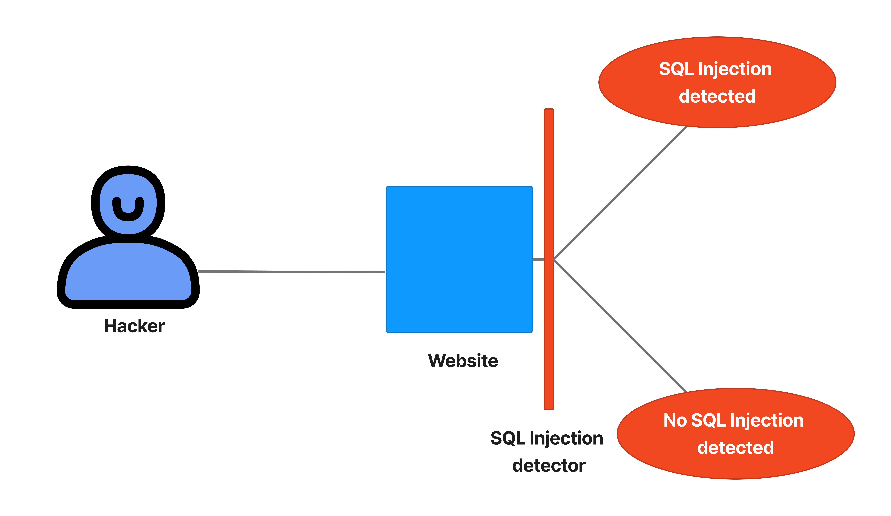

# sql_injection_scanner
This a simple python program to protect websites against SQL Injections. 

---

***By: Brunel BOUYA***
***This is a personal project for training purpose***
***LinkedIn: https://www.linkedin.com/in/brunelbouya/***

---

# What is SQL Injection attack?
According to OWASP, a SQL injection attack consists of insertion or “injection” of a SQL query via the input data from the client to the application. A successful SQL injection exploit can read sensitive data from the database, modify database data (Insert/Update/Delete), execute administration operations on the database (such as shutdown the DBMS), recover the content of a given file present on the DBMS file system and in some cases issue commands to the operating system. SQL injection attacks are a type of injection attack, in which SQL commands are injected into data-plane input in order to affect the execution of predefined SQL commands.

# Threat Modeling
SQL injection attacks allow attackers to spoof identity, tamper with existing data, cause repudiation issues such as voiding transactions or changing balances, allow the complete disclosure of all data on the system, destroy the data or make it otherwise unavailable, and become administrators of the database server.
SQL Injection is very common with PHP and ASP applications due to the prevalence of older functional interfaces. Due to the nature of programmatic interfaces available, J2EE and ASP.NET applications are less likely to have easily exploited SQL injections.
The severity of SQL Injection attacks is limited by the attacker’s skill and imagination, and to a lesser extent, defense in depth countermeasures, such as low privilege connections to the database server and so on. In general, consider SQL Injection a high impact severity.

# Project model architecture

# Test
Now let's test our code. We used the amazon official website to test if any SQL injection can be found:

# Test
No SQL Injection has been found from the tested website:

---

***Thanks for reading***
